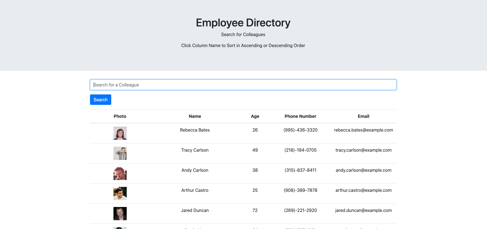
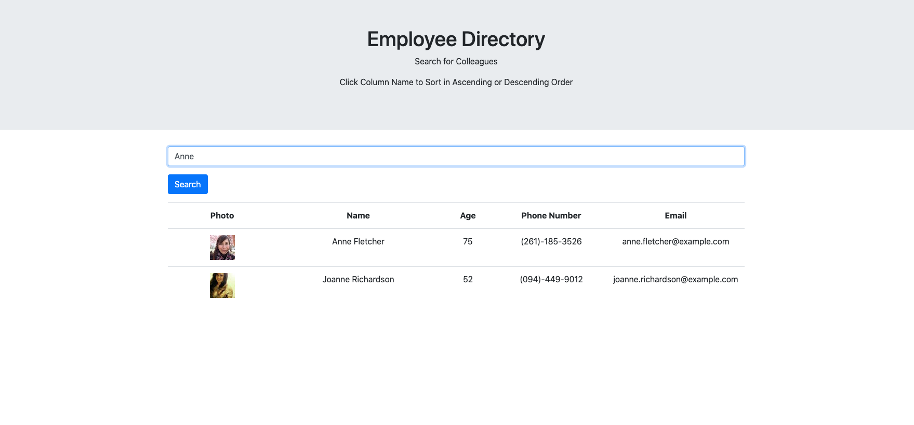
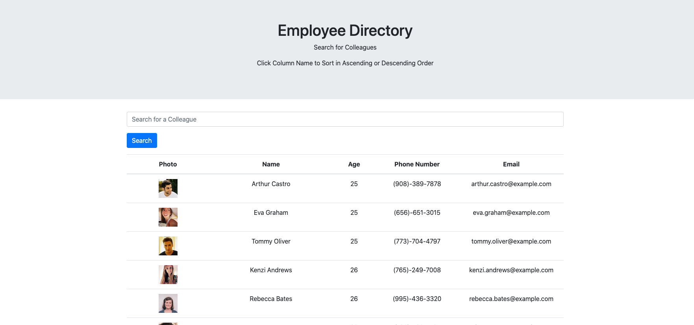

# EMPLOYEE DIRECTORY REACT APP HOMEWORK

# EMPLOYEE DIRECTORY

## Table of Contents:
*[Description](#description)  
*[Links](#links)  
*[Images](#images)  
*[Installation](#installation)  
*[Usage](#usage)  
*[License](#license)  
*[Contribute](#contribute)  
*[Tests](#tests)  
*[Questions](#questions)  

## DESCRIPTION:

Create an employee directory with React. Break up your application's UI into components, manage component state, and respond to user events.

## LINKS:

[Deployed Site](https://lindsaymorris813.github.io/employeeDirectory/)  
[Git Hub Repository](https://github.com/lindsaymorris813/employeeDirectory)

## IMAGES:

## INSTALLATION

react  
axios  
bootstrap  
gh-pages  
react-dom  

## USAGE

Categorizing items based on true/false, specifically burgers made and burgers eaten.

## LICENSE

N/A

## CONTRIBUTE

used UNCC Bootcamp Homework Dev Folder as inital code

## TESTS

N/A

## QUESTIONS

GitHub: lindsaymorris813

Email: lindsaymorris813@gmail.com
